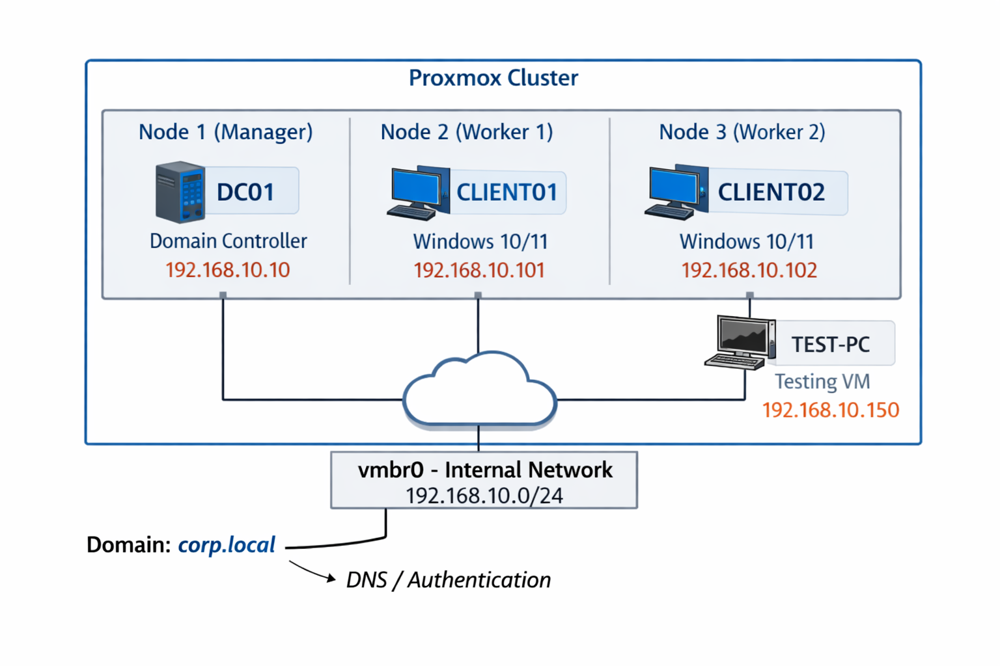

# Architecture Diagram

## Description

This diagram represents the Active Directory lab environment

- The Domain Controller provides authentication and DNS services
- Client machines are joined to the domain
- All systems will communicate over an isolated internal network
